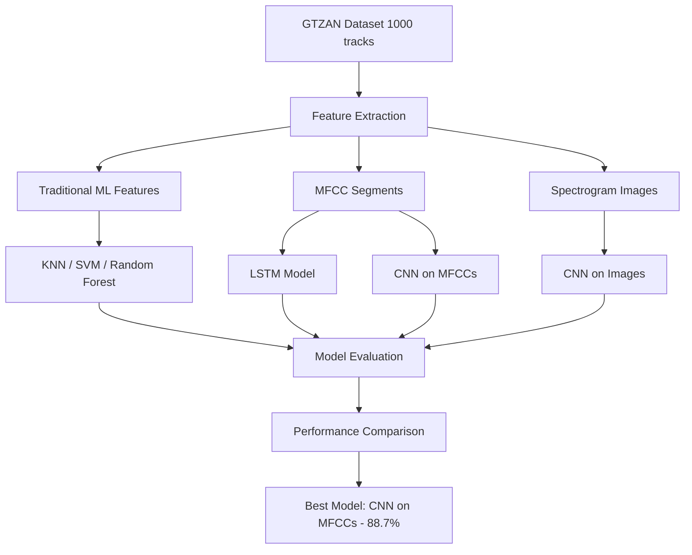

# 🎵 Music Genre Classification using Machine Learning

> An end-to-end machine learning project exploring traditional and deep learning approaches for automatic music genre classification

[](https://www.python.org/)
[](https://www.tensorflow.org/)
[](https://www.kaggle.com/)
[](LICENSE)

## 📌 Project Information

**Project Title:** Music Genre Classification using Machine Learning and Deep Learning

**Team Members:**
- chinthan k
- dhruv hegde

**Contributors:**
- chinthan k - Feature Engineering,model training and optimization
- dhruv hegde - feature extraction,training,Model Optimization

**Organization:** PES UNIVERSITY

**Project Duration:** 7-10-2025 - 14-10-2025

**Project Type:** Academic Research Project 

**Platform:** Kaggle Notebook

---

## 📖 Description

This project implements a comprehensive comparison of machine learning and deep learning techniques for music genre classification. Using the GTZAN dataset, we developed and evaluated six different models ranging from traditional algorithms like K-Nearest Neighbors to advanced deep learning architectures like Convolutional Neural Networks. Our best model (CNN on MFCC features) achieves 88.7% accuracy, demonstrating the effectiveness of deep learning for audio classification tasks.

**Key Objectives:**
- Compare traditional ML vs. deep learning approaches for audio classification
- Identify optimal feature representations for music genre recognition
- Develop a robust genre classification system using GTZAN dataset
- Provide insights into model performance and feature importance
- Explore different data representations (audio features, spectrograms, MFCCs)

---

## 📋 Table of Contents

- [Dataset](#-dataset)
- [Implemented Models](#-implemented-models)
- [Feature Extraction](#-feature-extraction)
- [Results](#-results)
- [Key Insights](#-key-insights)
- [Installation & Setup](#-installation--setup)
- [Step-by-Step Usage Guide](#-step-by-step-usage-guide)
- [Project Structure](#-project-structure)
- [Notebook Sections](#-notebook-sections)
- [Methodology](#-methodology)
- [Future Improvements](#-future-improvements)
- [Contributing](#-contributing)
- [License](#-license)
- [Acknowledgments](#-acknowledgments)

---

## 🎵 Dataset

The project utilizes the **GTZAN Dataset**, a benchmark dataset for music genre recognition research:
- **Total tracks:** 1,000 audio files
- **Duration:** 30 seconds per track
- **Genres:** 10 categories with 100 tracks each
  - Blues, Classical, Country, Disco, Hip-Hop, Jazz, Metal, Pop, Reggae, Rock
- **Format:** .wav audio files (22,050 Hz sampling rate)
- **Additional:** Pre-generated spectrogram images for CNN training

**Dataset Structure:**
```
musicdata/Data/
├── genres_original/          # Audio files (.wav)
│   ├── blues/
│   ├── classical/
│   ├── country/
│   ├── disco/
│   ├── hiphop/
│   ├── jazz/
│   ├── metal/
│   ├── pop/
│   ├── reggae/
│   └── rock/
└── images_original/          # Spectrogram images
    ├── blues/
    ├── classical/
    └── ...
```

---

## 🤖 Implemented Models

### Traditional Machine Learning (Trained on Extracted Features)
1. **K-Nearest Neighbors (KNN)**
   - Algorithm: Instance-based learning with k=5
   - Features: Statistical measures from audio features
   - Accuracy: **57.5%**

2. **Support Vector Machine (SVM)**
   - Kernel: RBF (Radial Basis Function)
   - Parameters: C=10, gamma=0.01
   - Accuracy: **71.5%**

3. **Random Forest**
   - Estimators: 300 trees
   - Max depth: None (fully expanded)
   - Min samples split: 5
   - Accuracy: **70.5%**

### Deep Learning Models

4. **LSTM Network (Sequential Model)**
   - Architecture: Bidirectional LSTM (64 units) × 2 layers
   - Input: MFCC features (40 coefficients, 10 segments)
   - Training: 50 epochs, Adam optimizer (lr=0.0005)
   - Accuracy: **76.0%**

5. **CNN on Images (Spectrogram-based)**
   - Architecture: 4 Conv2D layers (64→64→32→32 filters)
   - Input: Spectrogram images (288×432×3)
   - Training: Adam optimizer (lr=0.0001)
   - Accuracy: **65.5%**

6. **CNN on MFCC Features** ⭐ **Best Model**
   - Architecture: 3 Conv2D layers (32→128→128 filters)
   - Input: MFCC features reshaped (13 coefficients, 10 segments)
   - Training: 40 epochs, Adam optimizer, dropout=0.3
   - Accuracy: **88.7%**

---

## 🔧 Feature Extraction

The project employs comprehensive feature extraction using **librosa**:

### Audio Features (Traditional ML Models)
- **Chroma STFT** - Pitch class representation (mean, variance)
- **RMS Energy** - Root mean square energy (mean, variance)
- **Spectral Centroid** - Center of mass of spectrum (mean, variance)
- **Spectral Bandwidth** - Spread of spectrum (mean, variance)
- **Spectral Rolloff** - Frequency threshold (mean, variance)
- **Tempo** - Beats per minute estimation
- **MFCCs** - 20 coefficients with mean and variance (40 features total)

### MFCC Segments (Deep Learning Models)
- **Segmentation:** Each 30-second track divided into 10 segments (3 seconds each)
- **MFCC Coefficients:** 13 or 40 coefficients per segment
- **FFT Parameters:** n_fft=2048, hop_length=512
- **Total Features:** Results in time-series data suitable for LSTM/CNN

### Spectrogram Images (Image-based CNN)
- **Format:** RGB images (288×432 pixels)
- **Representation:** Visual frequency-time representation
- **Normalization:** Pixel values scaled to [0, 1]

---

## 📊 Results

Performance comparison on the test set:

| Model                      | Accuracy | Precision | Recall | F1-Score |
|:---------------------------|:--------:|:---------:|:------:|:--------:|
| KNN                        | 57.5%    | 0.592     | 0.575  | 0.572    |
| SVM                        | 71.5%    | 0.721     | 0.715  | 0.715    |
| Random Forest              | 70.5%    | 0.707     | 0.705  | 0.702    |
| LSTM (40 MFCCs)            | 76.0%    | 0.768     | 0.762  | 0.762    |
| CNN (Spectrogram Images)   | 65.5%    | -         | -      | -        |
| **CNN (13 MFCCs)** ⭐      | **88.7%**| **0.893** |**0.889**|**0.889**|

**Training Details:**
- Train/Test Split: 75% / 25% (with 20% of training as validation)
- Stratified sampling to maintain genre distribution
- Standard scaling applied to traditional ML features
- Data augmentation through segment-based sampling (10 segments per track)

---

## 💡 Key Insights

### Model Performance
- **Deep Learning Dominance:** CNN on MFCC features outperforms all other approaches by significant margin (88.7% vs 76.0% for next best)
- **Feature Representation Matters:** Direct MFCC features prove more effective than spectrogram images for CNNs
- **Sequential vs Spatial:** CNN captures spatial patterns in MFCCs better than LSTM captures temporal patterns
- **Traditional ML Limitations:** Best traditional model (SVM) achieves only 71.5%, showing clear advantage of deep learning

### Feature Importance
- **Most Important Features:** chroma_stft_mean, rms_mean, rms_var
- **MFCC Superiority:** Lower MFCC coefficients (1-13) capture most discriminative information
- **Segmentation Benefit:** Breaking tracks into segments provides data augmentation and captures temporal variation

### Genre Confusion Analysis
- **Most Confused Pairs:** Rock ↔ Metal, Jazz ↔ Blues
- **Easiest to Classify:** Classical music (distinct orchestral characteristics)
- **Challenge:** Modern genres with fusion elements (Hip-Hop, Pop)

### Model Characteristics
- **CNN Strengths:** Excellent at capturing local patterns in spectral features
- **LSTM Strengths:** Good for temporal dependencies but requires more data
- **Traditional ML:** Fast training but limited by hand-crafted features

---

## 🚀 Installation & Setup

### System Requirements

- **Platform:** Kaggle Notebook (GPU accelerated) or Local Jupyter Notebook
- **Python Version:** 3.8 or higher
- **RAM:** Minimum 8GB (16GB recommended for deep learning models)
- **Storage:** At least 5GB free space for dataset
- **GPU:** Optional but recommended for faster training (CUDA-compatible NVIDIA GPU)

### Prerequisites

The project requires the following Python libraries:

**Core Libraries:**
```python
numpy, pandas, matplotlib, seaborn
```

**Audio Processing:**
```python
librosa, soundfile
```

**Machine Learning:**
```python
scikit-learn
```

**Deep Learning:**
```python
tensorflow, keras
```

**Computer Vision (for image-based CNN):**
```python
opencv-python (cv2)
```

---

## 📥 Installation Options

### Option 1: Run on Kaggle (Recommended) ⭐

This is the **easiest and recommended method** as the notebook is designed for Kaggle:

1. **Visit Kaggle:**
   - Go to [Kaggle.com](https://www.kaggle.com/)
   - Sign in or create a free account

2. **Import the Notebook:**
   - Click on "Code" → "New Notebook"
   - Or copy the notebook file to Kaggle

3. **Add the Dataset:**
   - Search for "GTZAN Music Genre Dataset" in Kaggle Datasets
   - Add it to your notebook using "Add Data" button
   - Verify the path matches: `/kaggle/input/musicdata/Data/genres_original`

4. **Enable GPU:**
   - Go to Settings (right panel)
   - Accelerator → Select "GPU"
   - This significantly speeds up deep learning model training

5. **Run the Notebook:**
   - Click "Run All" or run cells sequentially
   - All dependencies are pre-installed on Kaggle

**Kaggle Advantages:**
- ✅ All libraries pre-installed
- ✅ Free GPU access
- ✅ Dataset integration
- ✅ No local setup required
- ✅ Easy sharing and collaboration

---

### Option 2: Run Locally

If you prefer running on your local machine:

#### Step 1: Clone the Repository

```bash
# Open terminal and navigate to your projects directory
cd /path/to/your/projects

# Clone the repository
git clone https://github.com/yourusername/music-genre-classification.git

# Navigate into the project directory
cd music-genre-classification
```

#### Step 2: Create Virtual Environment

**For Windows:**
```bash
python -m venv venv
venv\Scripts\activate
```

**For macOS/Linux:**
```bash
python3 -m venv venv
source venv/bin/activate
```

#### Step 3: Install Dependencies

```bash
# Upgrade pip
pip install --upgrade pip

# Install required packages
pip install numpy pandas matplotlib seaborn
pip install librosa soundfile
pip install scikit-learn
pip install tensorflow keras
pip install opencv-python
pip install jupyter notebook ipywidgets
pip install tqdm
```

**Or use requirements.txt:**
```bash
pip install -r requirements.txt
```

#### Step 4: Download GTZAN Dataset

**Manual Download:**
1. Visit [GTZAN Dataset](https://www.kaggle.com/datasets/dhruvhegde22/musicdata)
2. Download `genres.tar.gz` (about 1.2 GB)
3. Extract the archive
4. Place in project directory as: `data/genres_original/`

**Kaggle Dataset:**
```bash
# Install Kaggle API
pip install kaggle

# Set up Kaggle credentials (kaggle.json)
# Download dataset
kaggle datasets download -d andradaolteanu/gtzan-dataset-music-genre-classification
unzip gtzan-dataset-music-genre-classification.zip -d data/
```

#### Step 5: Update File Paths

Open the notebook and update the dataset path:

```python
# Change from Kaggle path:
base_dir = '/kaggle/input/musicdata/Data/genres_original'

# To your local path:
base_dir = './data/genres_original'  # or your actual path
```

#### Step 6: Launch Jupyter Notebook

```bash
jupyter notebook
```

Navigate to the notebook file and run!

---

## 🎯 Step-by-Step Usage Guide

### Understanding the Notebook Structure

The notebook is organized into **sequential sections** that should be run in order:

---

### 🔹 **Section 1: Setup & Data Loading**

**What it does:** 
- Imports all necessary libraries
- Sets up visualization styles
- Defines the dataset path
- Lists available genres

**Run this first!**

```python
# Key variables set here:
base_dir = '/kaggle/input/musicdata/Data/genres_original'
genres = ['blues', 'classical', 'country', 'disco', 'hiphop',
          'jazz', 'metal', 'pop', 'reggae', 'rock']
```

---

### 🔹 **Section 2: Feature Extraction**

**What it does:**
- Defines `extract_features()` function
- Loops through all audio files
- Extracts 51 features per track (tempo, MFCCs, spectral features, etc.)
- Creates and saves `extracted_features.csv`

**Time:** ~15-20 minutes for 1000 tracks

**Output:**
- DataFrame with 1000 rows × 53 columns
- CSV file saved for reuse

**Visualizations:**
- Waveforms for sample genres
- Spectrograms
- MFCC visualizations
- Chroma features

---

### 🔹 **Section 3: Traditional ML Models**

**What it does:**
- Loads the extracted features
- Performs label encoding
- Splits data (80/20 train/test)
- Trains three models: KNN, SVM, Random Forest

**Models trained:**
1. **KNN** (k=5) → 57.5% accuracy
2. **SVM** (RBF kernel) → 71.5% accuracy
3. **Random Forest** (300 trees) → 70.5% accuracy

**Output:**
- Classification reports for each model
- Confusion matrices
- Performance comparison chart

---

### 🔹 **Section 4: LSTM Deep Learning Model**

**What it does:**
- Loads audio files again
- Extracts MFCC segments (40 coefficients, 10 segments per track)
- Builds Bidirectional LSTM model
- Trains for 50 epochs
- Saves model as `GTZAN_LSTM.h5`

**Architecture:**
```
Input (130, 40) → Bidirectional LSTM(64) → Bidirectional LSTM(64) 
→ Dense(64, ReLU) → Dense(10, Softmax)
```

**Training time:** ~10-15 minutes with GPU

**Output:**
- Training/validation accuracy curves
- Test accuracy: **76.0%**

---

### 🔹 **Section 5: CNN on Images (Spectrograms)**

**What it does:**
- Loads pre-generated spectrogram images
- Resizes images to (288, 432, 3)
- Builds CNN model with 4 Conv2D layers
- Trains on image data

**Architecture:**
```
Conv2D(64) → MaxPool → Conv2D(64) → MaxPool → Conv2D(32) → MaxPool 
→ Conv2D(32) → MaxPool → Flatten → Dense(128) → Dense(10)
```

**Output:**
- Test accuracy: **65.5%**

---

### 🔹 **Section 6: CNN on MFCC Features** ⭐ **Best Model**

**What it does:**
- Extracts MFCC segments (13 coefficients, 10 segments)
- Reshapes as 2D input for CNN
- Builds optimized CNN architecture
- Trains for 40 epochs with dropout

**Architecture:**
```
Conv2D(32) → MaxPool → Conv2D(128) → MaxPool → Dropout(0.3) 
→ Conv2D(128) → MaxPool → Dropout(0.3) → GlobalAvgPool 
→ Dense(512) → Dense(10)
```

**Training time:** ~5-10 minutes with GPU

**Output:**
- Training history
- Test accuracy: **88.7%** 🎉

---

### 🔹 **Section 7: Comprehensive Evaluation**

**What it does:**
- Compares all models side-by-side
- Generates confusion matrices for each model
- Creates performance comparison charts
- Displays precision, recall, F1-scores

**Final Output:**
- Comprehensive comparison table
- Bar charts comparing all metrics
- Genre-wise performance analysis

---

## 📊 Running the Complete Pipeline

### Quick Run (All Sections)

1. **Open the notebook** in Kaggle or Jupyter
2. **Enable GPU** (if on Kaggle)
3. **Click "Run All"** from the menu
4. **Wait ~45-60 minutes** for complete execution

### Selective Execution

If you want to run specific models only:

**For Traditional ML only:**
```python
# Run sections: 1, 2, 3
```

**For LSTM only:**
```python
# Run sections: 1, 4
```

**For CNN (MFCC) only:**
```python
# Run sections: 1, 6
```

**For complete comparison:**
```python
# Run all sections: 1-7
```

---

## 📁 Project Structure

```
music-genre-classification/
│
├── notebook/
│   └── music_genre_classification.ipynb   # Main Kaggle notebook (all code)
│
├── data/                                   # Dataset (if running locally)
│   ├── genres_original/                    # Audio files (.wav)
│   │   ├── blues/
│   │   ├── classical/
│   │   └── ...
│   ├── images_original/                    # Spectrogram images
│   └── extracted_features.csv              # Generated features
│
├── models/                                 # Saved models (generated)
│   ├── GTZAN_LSTM.h5
│   └── cnn_mfcc_model.h5
│
├── outputs/                                # Generated visualizations
│   ├── audio_feature_visualization.png
│   ├── feature_statistics_by_genre.png
│   └── confusion_matrices/
│
├── requirements.txt                        # Python dependencies
├── README.md                               # This file
└── LICENSE                                 # MIT License
```

**Note:** Since this is a **single Kaggle notebook project**, all code is contained in one `.ipynb` file rather than separate scripts.

---

## 📚 Notebook Sections Breakdown

| Section | Description | Runtime | Output |
|:--------|:------------|:--------|:-------|
| **1. Setup** | Library imports, path configuration | <1 min | Environment ready |
| **2. Feature Extraction** | Extract audio features from all tracks | 15-20 min | extracted_features.csv |
| **3. Traditional ML** | Train KNN, SVM, Random Forest | 2-3 min | 3 models + metrics |
| **4. LSTM Model** | Build and train LSTM on MFCCs (40 coef) | 10-15 min | LSTM model + 76% accuracy |
| **5. CNN on Images** | Train CNN on spectrogram images | 8-12 min | Image CNN + 65.5% accuracy |
| **6. CNN on MFCCs** | Train CNN on MFCC features (13 coef) | 5-10 min | **Best model + 88.7% accuracy** |
| **7. Evaluation** | Compare all models, visualizations | 2-3 min | Comparison charts |

**Total Runtime:** ~45-60 minutes (with GPU)

---

## 🔬 Methodology

### Complete Workflow



### Detailed Steps

1. **Data Acquisition**
   - Load 1000 audio tracks (100 per genre)
   - Verify data integrity
   - Explore audio characteristics

2. **Feature Engineering**
   - Extract 51 statistical features per track
   - Generate MFCC segments (10 per track = 10,000 samples)
   - Use pre-generated spectrogram images

3. **Data Preprocessing**
   - Normalize features (StandardScaler)
   - Encode labels (0-9 for genres)
   - Split data: 75% train, 25% test (with validation)
   - Reshape data for model-specific requirements

4. **Model Development**
   - **Traditional ML:** Train with scikit-learn, tune hyperparameters
   - **LSTM:** Design sequential architecture, use temporal features
   - **CNN (Images):** Design 2D CNN for image classification
   - **CNN (MFCCs):** Design 2D CNN for spectral features

5. **Training Strategy**
   - Use Adam optimizer with learning rate tuning
   - Implement dropout for regularization
   - Monitor validation metrics
   - Save best models

6. **Evaluation**
   - Calculate accuracy, precision, recall, F1-score
   - Generate confusion matrices
   - Analyze per-genre performance
   - Compare all models

7. **Analysis**
   - Identify best approach (CNN on MFCCs)
   - Understand feature importance
   - Document misclassification patterns

---
# Part 2: Streamlit Application (Production) - CONTINUED

### 🚀 Installation & Running

#### Prerequisites

**System Requirements:**
- Python 3.8 or higher
- 4GB RAM minimum (8GB recommended)
- 500MB free disk space
- ffmpeg installed (for audio processing)

**Required Libraries:**
```bash
tensorflow
librosa
streamlit
numpy
pandas
soundfile
joblib
```

---

### 📥 Installation Steps

#### Step 1: Clone the Repository

```bash
# Clone the repository
git clone https://github.com/yourusername/music-genre-classification.git

# Navigate to project directory
cd music-genre-classification
```

#### Step 2: Create Virtual Environment

**For Windows:**
```bash
python -m venv venv
venv\Scripts\activate
```

**For macOS/Linux:**
```bash
python3 -m venv venv
source venv/bin/activate
```

#### Step 3: Install Dependencies

```bash
# Upgrade pip
pip install --upgrade pip

# Install all required packages
pip install -r requirements.txt
```

**Manual installation (if requirements.txt not available):**
```bash
pip install tensorflow librosa streamlit numpy pandas soundfile joblib
```

#### Step 4: Install ffmpeg

**Windows:**
- Download from [ffmpeg.org](https://ffmpeg.org/download.html)
- Extract and add to system PATH

**macOS:**
```bash
brew install ffmpeg
```

**Linux (Ubuntu/Debian):**
```bash
sudo apt-get update
sudo apt-get install ffmpeg
```

**Verify installation:**
```bash
ffmpeg -version
```

---

### 📁 Project Structure

```
music-genre-classification/
│
├── cnn_model.h5                      # Trained CNN model (88.7% accuracy)
├── extracted_features.csv            # Pre-extracted audio features dataset
├── new_modeui.py                     # Streamlit UI implementation
├── train_model.py                    # Model training script
├── requirements.txt                  # Python dependencies
├── README.md                         # Project documentation
├── LICENSE                           # MIT License
│
└── data/
    └── audio/                        # Audio files directory (for testing)
        ├── blues_sample.wav
        ├── classical_sample.wav
        └── ...
```

---

### 🎬 Running the Application

#### Quick Start

```bash
# Navigate to project directory
cd music-genre-classification

# Run the Streamlit application
streamlit run new_modeui.py
```

The application will automatically open in your default web browser at `http://localhost:8501`

#### Alternative Port

If port 8501 is already in use:
```bash
streamlit run new_modeui.py --server.port 8502
```

#### Run in Development Mode

For auto-reload on code changes:
```bash
streamlit run new_modeui.py --server.runOnSave true
```

#### Run on Network

To access from other devices on your network:
```bash
streamlit run new_modeui.py --server.address 0.0.0.0
```

---

### 📖 Usage Guide

#### Step 1: Launch the Application

After running the command, you'll see:
```
  You can now view your Streamlit app in your browser.

  Local URL: http://localhost:8501
  Network URL: http://192.168.x.x:8501
```

The web interface will display:
- Project title and description
- File upload widget
- Genre information cards

#### Step 2: Upload an Audio File

**Supported Formats:**
- `.wav` (recommended - faster processing)
- `.mp3` (widely supported)
- Other formats supported by librosa

**Upload Methods:**
1. Click the "Browse files" button
2. Select your audio file from your computer
3. Or drag-and-drop the file into the upload area

**File Recommendations:**
- **Duration:** 30 seconds (matches training data for best accuracy)
- **Quality:** Good audio quality recommended
- **Size:** Up to 10MB
- **Format:** WAV format preferred for faster processing

#### Step 3: View Prediction Results

Once uploaded, the app automatically processes the file and displays:

**1. Audio Player**
- Listen to your uploaded track
- Verify the file uploaded correctly

**2. Predicted Genre**
- Large, prominent display of the predicted genre
- Example: "ROCK", "CLASSICAL", "JAZZ"

**3. Confidence Score**
- Percentage indicating model's confidence
- Example: "92.3% confidence"

**4. Probability Distribution Chart**
- Interactive bar chart showing probabilities for all 10 genres
- Visual representation of how confident the model is about each genre
- Color-coded for easy interpretation

**Example Output:**
```
🎵 Predicted Genre: ROCK
Confidence: 92.3%

Probability Distribution:
Rock:      ████████████████████ 92.3%
Metal:     ██                    4.2%
Pop:       █                     1.8%
Blues:     █                     0.9%
Classical:                       0.4%
Country:                         0.2%
Disco:                           0.1%
Hip-Hop:                         0.1%
Jazz:                            0.0%
Reggae:                          0.0%
```

#### Step 4: Interpret Results

**High Confidence (>80%):**
- ✅ Strong prediction
- Model is very confident about the genre
- Clear genre characteristics detected

**Medium Confidence (60-80%):**
- ⚠️ Good prediction with some uncertainty
- Track might have fusion elements
- Consider secondary genre predictions

**Low Confidence (<60%):**
- ❌ Uncertain prediction
- Track might be genre-bending or experimental
- Poor audio quality may affect results
- Consider the top 2-3 genre predictions

#### Step 5: Try Multiple Files

- Upload different audio files to compare predictions
- Click "Browse files" again to upload a new track
- Previous prediction will be automatically replaced
- No need to refresh the page between uploads

---

### 🔍 Troubleshooting

#### Common Issues and Solutions

**1. Model File Not Found**
```
Error: Unable to load model from cnn_model.h5
```
**Solution:**
```bash
# Verify model file exists
ls cnn_model.h5

# If missing, retrain the model
python train_model.py

# Or download from releases
```

**2. Audio Processing Error**
```
Error: PySoundFile failed. Trying audioread instead.
```
**Solution:**
- Install ffmpeg: Check installation with `ffmpeg -version`
- Convert audio to WAV format first
- Ensure file is not corrupted:
```bash
ffmpeg -i input.mp3 output.wav
```

**3. Import Error for Libraries**
```
ModuleNotFoundError: No module named 'librosa'
```
**Solution:**
```bash
# Reinstall dependencies
pip install --upgrade librosa soundfile numpy
```

**4. Streamlit Not Opening**
```
Error: Address already in use
```
**Solution:**
```bash
# Use different port
streamlit run new_modeui.py --server.port 8502

# Or kill existing process (Windows)
taskkill /F /IM streamlit.exe

# Or kill existing process (Linux/Mac)
pkill -f streamlit
```
---
## 🔖 Keywords

`music-genre-classification` `machine-learning` `deep-learning` `audio-classification` `cnn` `lstm` `tensorflow` `keras` `scikit-learn` `librosa` `gtzan-dataset` `kaggle` `mfcc` `spectrogram` `audio-processing` `music-information-retrieval`

---

**Made with ❤️ and 🎵 by team 31**

*Last Updated: 14-10-2025*
